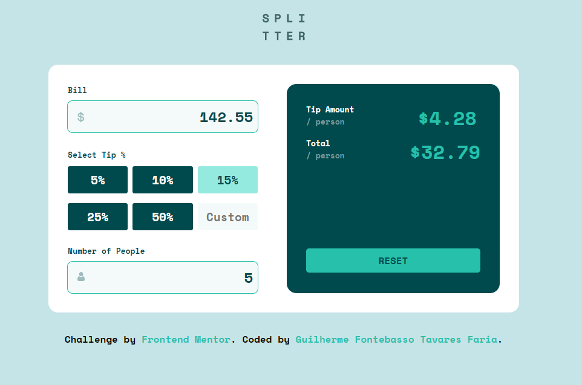
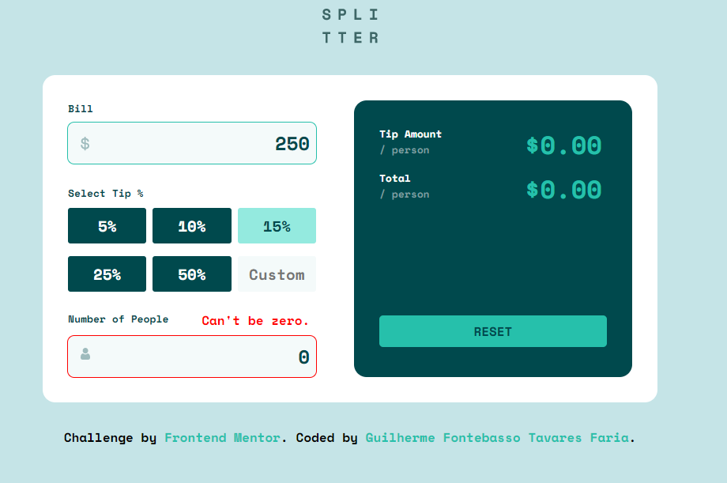
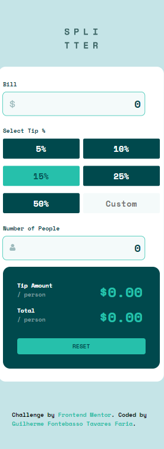

# Frontend Mentor - Tip calculator app solution

This is a solution to the [Tip calculator app challenge on Frontend Mentor](https://www.frontendmentor.io/challenges/tip-calculator-app-ugJNGbJUX).

## Table of contents

- [Frontend Mentor - Tip calculator app solution](#frontend-mentor---tip-calculator-app-solution)
  - [Table of contents](#table-of-contents)
  - [Overview](#overview)
    - [The challenge](#the-challenge)
    - [Screenshot](#screenshot)
    - [Links](#links)
  - [My process](#my-process)
    - [Built with](#built-with)
    - [What I learned](#what-i-learned)
    - [Continued development](#continued-development)
    - [Useful resources](#useful-resources)
  - [Author](#author)

## Overview

### The challenge

Users should be able to:

- View the optimal layout for the app depending on their device's screen size
- See hover states for all interactive elements on the page
- Calculate the correct tip and total cost of the bill per person

### Screenshot

### Links

- Github: [Repository](https://github.com/GFTF0906/tip-calc-app)

## My process

### Built with

- Semantic HTML5 markup
- CSS custom properties
- Flexbox
- CSS Grid

### What I learned

This project helped me understand more about SASS. It was my first project using it!

### Continued development

I pretend to continue using SASS!

### Useful resources

- [SASS](https://sass-lang.com/guide) - This helped me understand more about Mixins, Nesting and variables.

## Author

- Github - [Guilherme Fontebasso Tavares Faria](https://github.com/GFTF0906)
- Frontend Mentor - [@GFTF0906](https://www.frontendmentor.io/profile/GFTF0906)
- Twitter - [@echolovesjava](https://twitter.com/echolovesjava)
